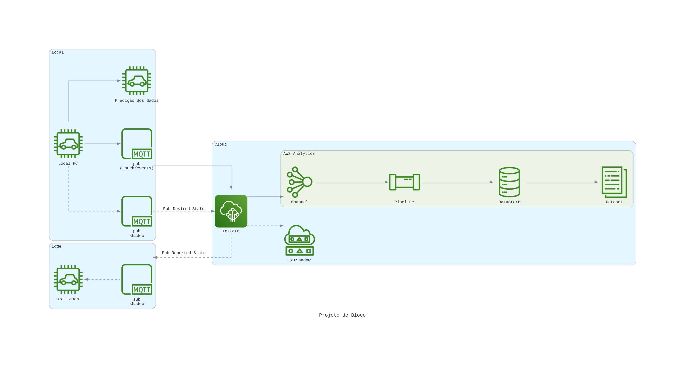

# pb_iot
Projeto educacional  para estudos

Estrutura do projeto:

	data:
		- raw
		- processed
		- modeling
	docs:
		- project
		- datareport
		- model
	code:
		- dataprep
		- model
		- operatinalization
	assets:

Rodar projeto:
* docker build . -t sensoraws
* docker run -it sensoraws /bin/bash

* Preparação dos dados:
  - python3 code/dataprep/prep.py

* Envio dos dados para a AWS
	- python3 code/operationalization/send_data_to_aws.py

* Envio dos dados para a sombra/shadow da coisa:
	- python3 code/operationalization/publish_shadow_data_to_aws.py

* Recebimento dos dados pelo sombra/shadow da coisa:	
	- python3 code/operationalization/subscribe_shadow_data_to_aws.py
